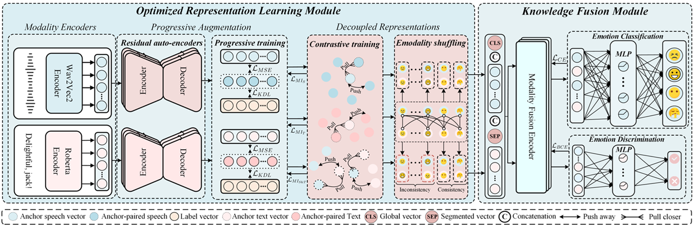

This paper has been accepted for publication at the 33rd ACM International Conference on Multimedia (ACM MM 2025).
# DRKF: Decoupled Representations with Knowledge Fusion for Multimodal Emotion Recognition

[](https://pytorch.org/)
[](LICENSE)


> Official PyTorch implementation of **DRKF** (ACM MM 2025 Oral).  
> Achieves SOTA on IEMOCAP, MELD, and MSED datasets for multimodal emotion recognition.

---


## 🔥 Key Features
- **ORL Module**: Decouples task-relevant features via progressive modality augmentation
- **KF Module**: Lightweight self-attention fusion with emotion inconsistency modeling
- **ED Submodule**: Preserves discriminative cues for emotionally inconsistent scenarios
- **SOTA Performance**: Outperforms 15+ baselines on three benchmark datasets

## 📊 Results Summary
| Dataset  | ACC/WACC | F1/WF1  | Avg    | Improvement |
|----------|-----------|---------|--------|-------------|
| IEMOCAP  | 80.7/79.9 | -       | 80.3   | +2.55%      |
| MELD     | 66.7      | 65.4    | 66.0   | +0.60%      |
| MSED     | 50.6      | 52.0    | 51.7   | +4.02%      |

![Framework]
*Figure: DRKF Architecture (Sec 3.2)*

---

## 🚀 Quick Start

### 1. Environment Setup
```bash
# Create environment from YAML (includes exact CUDA/cuDNN versions)
conda env create -f environment.yaml -n drkf
conda activate drkf

Download feature encoder weights
'wav2vec2-large-uncased'
'roberta-large-uncased'
```

### 2. Configuration
After downloading the dataset, configure the paths in `config/hyper_params_config.py`

### 3. Run Training (IEMOCAP)
```bash
# Single-command execution (all pretrained models are included locally)
python train.py 
```

# 🔖 Citation
If you find this repository useful, please cite our paper: